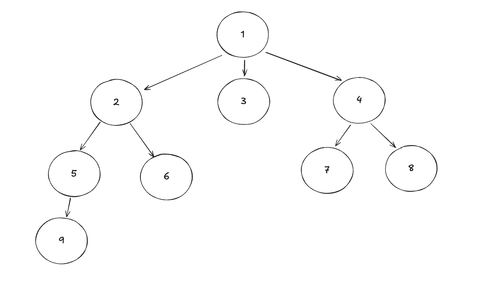
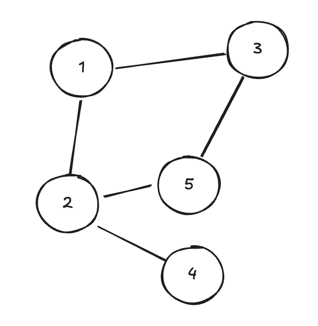

# Breadth First Search 

## Prerequisites

You should have a good understanding of [Trees](../data_structures/trees.md) and [Graphs](../data_structures/graphs.md) before attempting to understand how to traverse them.

Looking at [Tree Traversal Methods](./tree_traversals.md) is a good warm up before tackling Breadth First Search (BFS).

## Introduction

Breadth First Search (BFS) is an approach to searching graph data structures. You can use BFS to visit every node in a graph, or search for a specific node.

BFS involves visiting the full breadth of edges at the current level, before visiting the next level of nodes. 

It can be written as a recursive algorithm, or iteratively, but with either approach you'll need to:

1. From the current node, build a queue of nodes that are linked to this node.
2. Visit the first node in the queue, and add all of the child nodes from this node to the end of the queue.
3. Continue visiting nodes in the queue, until the queue is empty

If you're using BFS in a graph, then you'll need to keep track of visited nodes, so you can avoid visiting the same node multiple times and getting stuck in loops. 

In a tree, BFS traversal would visit nodes in the following order:

And in a cyclic graph, this is an example visitation order:

## Study Areas

- [ ] Write BFS using an iterative algorithm, use it to visit all the nodes in a tree. The algorithm should visit every node, and return an array of the values in order of visitation.
- [ ] Write BFS using a recursive algorithm
- [ ] Try using your algorithms to visit lots of different graph structures. Check that the array outputs values in BFS order.

## Problems

You'll need to get confident traversing graphs represented as Arrays and Hash Tables to solve most of these problems.

- [ ] [Clone Graph](https://leetcode.com/problems/clone-graph/) Use BFS here, if you've already solved using DFS.
- [ ] [Symmetric Tree](https://leetcode.com/problems/symmetric-tree)
- [ ] [Find if Path Exists in Graph](https://leetcode.com/problems/find-if-path-exists-in-graph/)
- [ ] [Keys and Rooms](https://leetcode.com/problems/keys-and-rooms/)
- [ ] [Island Perimeter](https://leetcode.com/problems/island-perimeter)

## Resources

[Interview Cake BFS Article](https://www.interviewcake.com/concept/python/bfs)

## Next Steps

If you haven't already, take a look at [Depth First Search](./depth_first_search.md)
