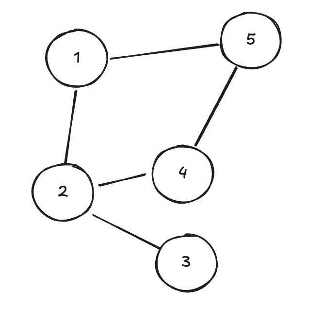

# Depth First Search 

## Prerequisites

You should have a good understanding of [Trees](../data_structures/trees.md) and [Graphs](../data_structures/graphs.md) before attempting to understand how to traverse them.

Looking at [Tree Traversal Methods](./tree_traversals.md) is a good warm up before tackling Depth First Search (DFS).

## Introduction

Depth First Search (DFS) is an approach to searching graph data structures. You can use DFS to visit every node in a graph, or search for a specific node.

DFS involves visiting the full depth of a graph link before visiting the next path of nodes. 

It can be written as a recursive algorithm, or iteratively, but with either approach you'll need to keep following the path of edges to nodes until you either:

1. Reach a node that has already been visited, or
2. Reach a node that has only one edge (that you traversed to get to the node).

In both of these cases, the algorithm should backtrack until a node with an unvisited edge is found, and repeat that pattern.

In a tree, DFS traversal would visit nodes in the following order:

And in a cyclic graph, this is an example visitation order:

As you can see, in the cyclic graph traversal, if you do not keep track of 'visited' nodes, then the algorthim will get stuck in an infinite loop of visiting nodes 1, 2, 4 & 5.

## Study Areas

- [ ] Write DFS using an iterative algorithm, use it to visit all the nodes in a tree. The algorithm should visit every node, and return an array of the values in order of visitation.
- [ ] Write DFS using a recursive algorithm
- [ ] Try using your algorithms to visit lots of different graph structures. Check that the array outputs values in DFS order.

## Problems

- [ ] [Maximum Depth of Binary Tree](https://leetcode.com/problems/maximum-depth-of-binary-tree)
- [ ] [Path Sum](https://leetcode.com/problems/path-sum/)
- [ ] [Same Tree](https://leetcode.com/problems/same-tree/)
- [ ] [Invert Binary Tree](https://leetcode.com/problems/invert-binary-tree)
- [ ] [Clone Graph](https://leetcode.com/problems/clone-graph/)

## Resources

[Interview Cake DFS Article](https://www.interviewcake.com/concept/python/dfs?)

## Next Steps

If you haven't already, take a look at [Breadth First Search](./breadth_first_search.md)
