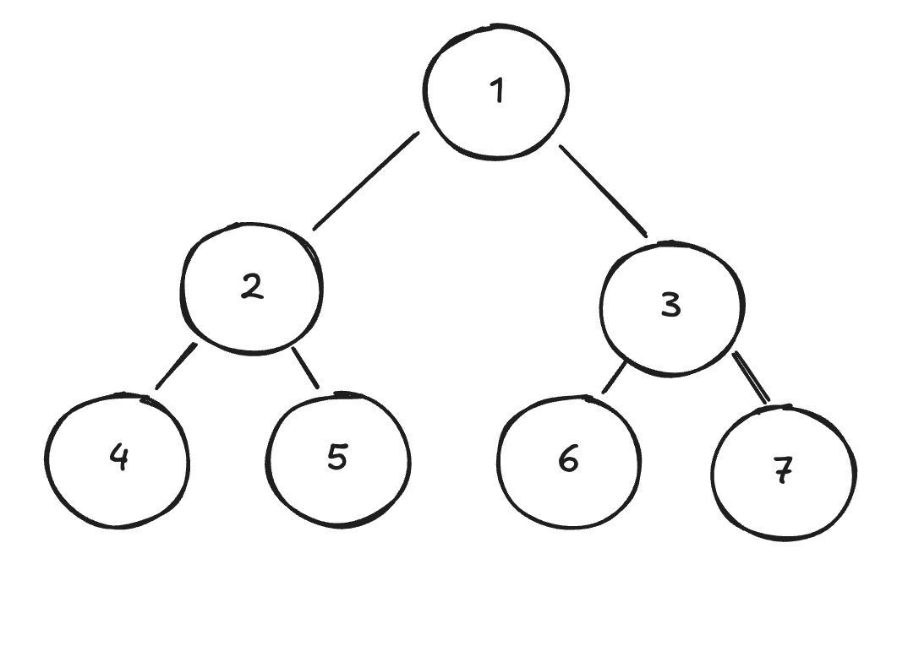

# Tree Traversals 

## Prerequisites

You should have a good understanding of [Trees](../data_structures/trees.md) before attempting to understand how to traverse them.

## Introduction

Tree traversals describe the various ways that you can access the nodes within a Tree.

There are three patterns to cover:

- Pre-order traversal: traverse the left child, then the right child, then the current node.
- In-order traversal: traverse the left child, then the current node, then the right child.
- Post-order traversal: visit the current node, then traverse the left child, then the right child.

## Study Areas

For the above tree, write down the order the nodes will be visited when using each of the traversal types:
- [ ] Pre-order traversal
- [ ] In-order traversal
- [ ] Post-order traversal

Write code for each of these problems:

- [ ] [Pre-order traversal](https://leetcode.com/problems/binary-tree-preorder-traversal/)
- [ ] [In-order traversal](https://leetcode.com/problems/binary-tree-inorder-traversal)
- [ ] [Post-order traversal](https://leetcode.com/problems/binary-tree-postorder-traversal/)

## Problems

I'm not including any specific problems here, you should practice tree problems in general to get confident using each of these approaches.

## Resources

[Interview Cake Binary Tree Article](https://www.interviewcake.com/concept/python/binary-tree?) this has a section on tree traversals

## Next Steps

Binary Search Tree _(content coming soon)_ is a binary tree used to organise information. Or you could look at Depth First Search and Breadth First Search, which are both algorithms for searching for values in trees and graphs. _(content coming soon)_
