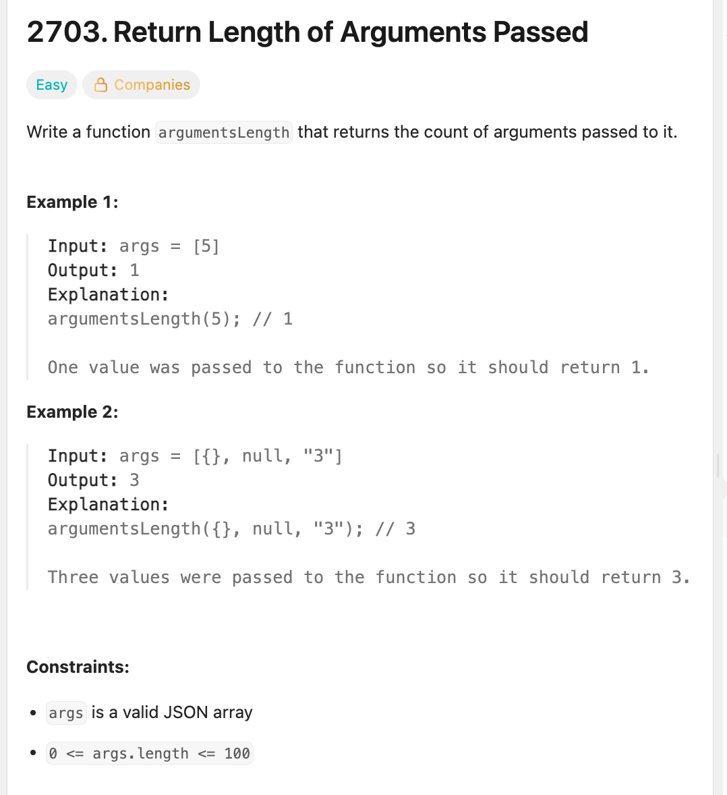

# Guide to Leetcode

As someone who was not at all familiar with Computer Science as it is taught at university-level, I found LeetCode pretty overwhelming at first.

It can be different to understand how to read a problem statement, and then frustrating when your code that passes the tests is failing or timing out on Submission.

This guide aims to make it all a bit clearer!

## Finding a Problem

If you are new to LeetCode, make sure you are starting off with problems that you are likely to be able to solve. This isn't cheating, it's common sense!

To find suitable problems, you can filter the Problems list by 'difficulty', and then order by Acceptance, to show the 'Easy' problems that have the highest acceptance.

There are other ways to find problems, e.g. by using the category tags, but this is a good place to start.

## Understanding the Problem



The above shows the LeetCode description section. In here you will find:

1. A description of the problem to be solved
2. Some examples of expected outputs of the code, given a specific input
3. The constraints

### Problem statement
The description should be self-explanatory, but the quality of the problem statement can vary wildly! Some problem writers include lots of information and even diagrams to illustrate the problem to be solved. Others.... don't.

If you don't understand the problem statement, move on to a different question for now.

### Examples
Each example should include the arguments that will be passed to the function, and the expected output.

Usually, these examples are included as Tests for you to run your code against before submitting. 

These tests are usually there to help make the problem statement clear, and they will not usually flag up edge cases - although it should be possible to stop these based on the problem statement.

### Constraints

This section is easy to overlook, but is important!

It specifies the boundaries of the inputs, so looking at the two constraints that have been given for the above description:

```
- args is a valid JSON array

```
This means that the function will only ever be passed an array.
```
- 0 <= args.length <= 100
```
This means that the length of that array will be between 0 (empty) and 100 elements.

These numbers can get very big! Constraints usually provides helpful context on the problem, and reading them carefully can save a lot of time!

## Writing & Submitting Code

The right section of the screen is an editor, for you to write your solution. You can change the language if you wish.

The function is already defined, you just need to write some code to solve the problem statement. 

When you are ready to run your code, it's a good idea to use the 'Run' button to run it against the test cases.

If you want to add more test cases, you can do this by clicking the 'Testcase' tab in the bottom section of this screen, and then the '+' to add a new one. This is useful when you have a failing case after hitting 'Submit' and want to debug.

You can log to the console if you want to debug.

Once you are confident that your code is ready, hit 'Submit' to run it against a broader range of testcases, that will include edge cases and inputs that go right to the bounds of the constraints.


