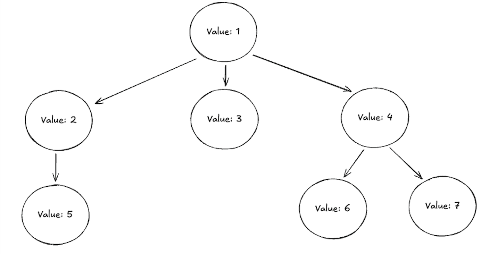

# Trees

## Prerequisites

I would recommend looking at [Linked Lists](./linked_lists.md) before jumping into Trees, as both structures are composed of nodes, but linked lists are slightly simpler to navigate.

## Introduction

A Tree is a hierarchical data structure that starts with a root at the top, which has 0 or more child nodes. Each child node can also have 0 or more child nodes:

In addition to have children, a Node will also have a value.

We interact with trees all the time - for example a filesystem is a tree structure:
 - the root directory is the root of the tree (`~`)
 - Every folder and file within the root directory is a child node
 - Each of these folders can contain 0 or more files and folders, which are also child nodes. 

Trees can be used capture parent/child relationships between values, or to make it easier to search for information (see Binary Search Trees _(content coming soon)_).

It's a good idea to be familiar with how to create, traverse and manipulate trees.

## Study Areas

- [ ] Be able to describe what is meant by the `root` of a Tree, and point to the `root` in the above image.
- [ ] Be able to describe what is meant by `leaf nodes` of a Tree, and point to these in the above image.
- [ ] Describe the `depth` (might also be described as `height`) of the above tree
- [ ] Build you own version of a tree, using Nodes. The tree should have a root node, which can have 0 or more child nodes. Each child node can also have 0 or more child nodes
- [ ] Learn how to traverse your tree, and return an array of it's values, using [In-Order Traversal]() _(content coming soon, see the Interview Cake resource below)_

### Going Further

There are many different ways to traverse trees (and graphs) - if you want to dig deeper you can look at:

_More detailed guides to these algorithms are coming soon_

- [ ] Pre-Order Traversal
- [ ] Post-Order Traversal
- [ ] Depth First Search (DFS)
- [ ] Breadth First Search (BFS)

For each of these, think about how you could write the algorithm iteratively (e.g. using a loop) vs writing it using recursion - and which approach feels more intuitive to you.

Some of these might feel easier to understand when writing a recursive function, others might be easier to understand working iteratively. There is (usually) not a 'correct' approach, you can use whichever approach you prefer.

## Practice Problems

Most problems in LeetCode use Binary Trees, which is a type of Tree. However, not all trees are binary trees, so I've found some problems that are not binary tree specific.

- [ ] [Maximum Depth of N-ary Tree](https://leetcode.com/problems/maximum-depth-of-n-ary-tree)
- [ ] [N-ary Tree PreOrder Traversal](https://leetcode.com/problems/n-ary-tree-preorder-traversal)
- [ ] [N-ary Tree PostOrder Traversal](https://leetcode.com/problems/n-ary-tree-postorder-traversal)

You will get plenty more practice in the Binary Tree section!

## Resources

- [Interview Cake - Trees](https://www.interviewcake.com/concept/python/tree?)

## Next Steps

You can either understand the different Traversal Methods _(content coming soon)_, or look at Binary Trees in more detail _(content coming soon)_.

